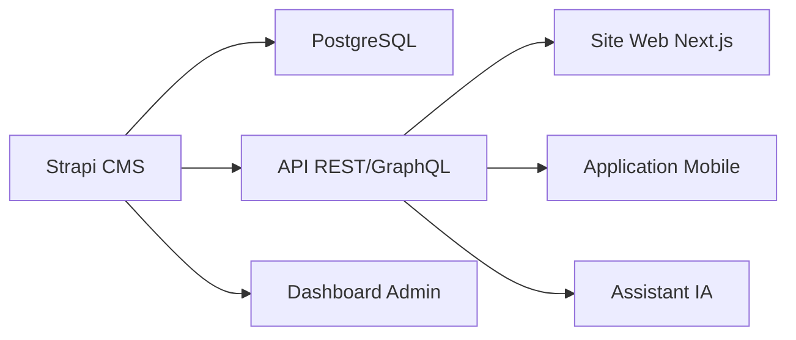

Vos donnees sont votre actif le plus precieux. Nous les collectons, les structurons, les enrichissons et les rendons exploitables pour alimenter vos systemes marketing, CRM et IA.

<Note type="info" title="Notre Approche">
Nous combinons **automation no-code** (n8n), **scripting custom** (Python), et **outils open-source** (Strapi, Metabase) pour creer des solutions de data engineering pragmatiques et scalables.
</Note>

---

## Nos Expertises Data

Notre approche couvre l'ensemble de la chaine de valeur de la donnee : collecte, transformation, stockage, exploitation.

<CardGrid>
  <Card
    title="Scraping & Collecte"
    description="Extraction automatisee de donnees depuis LinkedIn, sites web, APIs publiques pour alimenter vos bases."
  />
  <Card
    title="Scoring & Enrichissement"
    description="Qualification automatique de leads, enrichissement de donnees contact, scoring comportemental."
  />
  <Card
    title="Optimisation CRM"
    description="Integration, nettoyage, deduplication, workflows automatises dans vos CRM (HubSpot, Salesforce, Pipedrive)."
  />
  <Card
    title="Creation de CMS"
    description="Developpement de CMS headless sur mesure avec Strapi pour gerer vos contenus et donnees."
  />
</CardGrid>

---

## 1. Scraping & Collecte de Donnees

Nous collectons des donnees qualifiees depuis diverses sources pour alimenter vos operations marketing et commerciales.

### Sources de Donnees

**LinkedIn & Reseaux Sociaux**
- Scraping de profils cibles (postes, entreprises, secteurs)
- Extraction de listes de contacts depuis Sales Navigator
- Monitoring de posts et d'engagement

**Sites Web & Annuaires**
- Extraction de catalogues produits concurrents
- Scraping d'annuaires professionnels
- Collecte d'avis clients et reviews

**APIs Publiques**
- Integration de bases de donnees entreprises (Sirene, Pappers, etc.)
- Enrichissement via APIs tierces (Clearbit, Hunter, etc.)
- Veille concurrentielle automatisee

### Technologies Utilisees

<Step>
  <StepItem title="n8n Workflows">
    Workflows automatises pour scraping recurrent, monitoring, et collecte schedulee. Interface visuelle pour orchestrer les sources.
  </StepItem>
  <StepItem title="Python Scripts">
    Scripts custom avec BeautifulSoup, Scrapy, Selenium pour scraping complexe necessitant du rendu JavaScript ou de l'authentification.
  </StepItem>
  <StepItem title="Proxies & Rotation">
    Gestion de proxies rotatifs et rate limiting pour eviter les blocages. Scraping ethique et respectueux des robots.txt.
  </StepItem>
  <StepItem title="Stockage Structure">
    Export vers PostgreSQL, Airtable, ou directement dans votre CRM. Donnees nettoyees et deduplicees.
  </StepItem>
</Step>

### Cas d'Usage

**Generation de Leads B2B**
- Scraping quotidien de 500-1000 profils LinkedIn cibles
- Enrichissement automatique (email, telephone, taille entreprise)
- Export vers CRM avec scoring de qualite

**Veille Concurrentielle**
- Monitoring des prix concurrents
- Alertes sur nouveaux produits ou contenus
- Dashboard de suivi en temps reel

---

## 2. Scoring & Enrichissement

Transformer des donnees brutes en insights actionnables pour vos equipes commerciales et marketing.

### Scoring de Leads

**Modeles de Scoring Automatises**

Nous construisons des algorithmes de scoring personnalises bases sur :
- Fit ICP (Ideal Customer Profile) : taille entreprise, secteur, localisation
- Signaux d'engagement : ouvertures emails, visites site, telechargements
- Donnees comportementales : activite LinkedIn, participation evenements
- Technographie : outils utilises (detectes via BuiltWith, Wappalyzer)

**Implementation**

```python
# Exemple simplifie de scoring
score = 0
if company_size > 50: score += 20
if industry in target_industries: score += 30
if email_opened: score += 15
if visited_pricing_page: score += 25
# Score final : 0-100
```

Le scoring est recalcule automatiquement et synchronise avec votre CRM.

### Enrichissement de Donnees

**Completion Automatique**

A partir d'une liste de contacts partiels (nom + entreprise), nous enrichissons :
- Email professionnel (via Hunter, Dropcontact, etc.)
- Telephone direct
- Poste et anciennete
- Taille et CA de l'entreprise
- Technologies utilisees
- Presence sur reseaux sociaux

**Outils & Workflows**

- **n8n** pour orchestrer les enrichissements multi-sources
- **APIs tierces** : Clearbit, Hunter, Lusha, Dropcontact
- **Validation** : verification email, scoring de confiance
- **Deduplication** : fusion intelligente des doublons

---

## 3. Optimisation CRM

Votre CRM est le coeur de votre operation commerciale. Nous le rendons propre, automatise et exploitable.

### Nettoyage & Structuration

**Audit de Donnees**
- Identification des doublons (fuzzy matching)
- Detection des donnees obsoletes ou incompletes
- Analyse de la qualite des champs cles

**Deduplication Intelligente**
- Fusion automatique ou manuelle selon niveau de confiance
- Conservation de l'historique et des interactions
- Regles personnalisees selon votre business

**Normalisation**
- Standardisation des formats (telephone, adresse, etc.)
- Categorisation automatique (secteur, taille, segment)
- Enrichissement des champs manquants

### Automatisation de Workflows

**Scenarios Typiques**

<CardGrid>
  <Card
    title="Lead Routing Automatique"
    description="Assignation intelligente des leads aux commerciaux selon territoire, secteur, ou charge de travail."
  />
  <Card
    title="Sequences de Suivi"
    description="Declenchement automatique de sequences email selon le comportement (demo demandee, essai expire, etc.)."
  />
  <Card
    title="Scoring en Temps Reel"
    description="Mise a jour automatique du score de lead selon activite. Alertes aux commerciaux sur leads chauds."
  />
  <Card
    title="Synchronisation Multi-Outils"
    description="Sync bidirectionnelle entre CRM, outils marketing, support client pour une vue unifiee."
  />
</CardGrid>

### Integrations CRM

Nous travaillons avec tous les CRM majeurs :
- **HubSpot** : Workflows, custom properties, integrations
- **Salesforce** : Apex triggers, Lightning components, APIs
- **Pipedrive** : Automations, custom fields, webhooks
- **Monday.com / Airtable** : No-code CRM sur mesure

---

## 4. Creation de CMS Headless

Pour gerer vos contenus, produits ou donnees complexes, nous developpons des CMS sur mesure bases sur des technologies open-source.

### Pourquoi Strapi ?

**Strapi** est notre framework de choix pour creer des CMS headless :
- **Open-source** et gratuit (self-hosted)
- **Flexible** : schemas de donnees personnalisables
- **APIs auto-generees** (REST + GraphQL)
- **Interface admin** moderne et intuitive
- **Extensions** : plugins, custom fields, workflows

### Cas d'Usage

**CMS Marketing**
- Gestion de blog / articles
- Bibliotheque de ressources (ebooks, whitepapers)
- Etudes de cas et temoignages clients
- Publication multi-canaux (site, app, newsletter)

**PIM (Product Information Management)**
- Catalogue produits centralise
- Gestion des specifications techniques
- Images et medias associes
- Export vers e-commerce (Shopify, WooCommerce)

**Base de Connaissances Interne**
- Documentation produit
- Processus et procedures
- FAQ et support
- Recherche semantique avec IA

### Architecture Typique



### Notre Offre

**Setup & Customisation**
- Installation et configuration Strapi
- Design du schema de donnees
- Customisation de l'interface admin
- Configuration des permissions
- Integration avec votre stack existante

**Tarif** : A partir de 5 000€ (selon complexite)

**Support & Hebergement**
- Hebergement sur infra securisee (AWS/GCP)
- Backups automatiques
- Monitoring et alerting
- Support technique
- Evolutions et maintenance

**Tarif** : A partir de 500€/mois

---

## Technologies & Stack

Notre stack technique pour le data engineering :

| Categorie | Technologies |
|-----------|--------------|
| **Orchestration** | n8n, Airflow, cron jobs |
| **Scraping** | Python (Scrapy, BeautifulSoup, Selenium), Apify |
| **Transformation** | Python (Pandas, Polars), dbt |
| **Stockage** | PostgreSQL, MongoDB, Airtable, Google Sheets |
| **CMS** | Strapi, Directus, Payload CMS |
| **CRM** | HubSpot, Salesforce, Pipedrive, Monday.com |
| **Visualisation** | Metabase, Grafana, Tableau |
| **Infrastructure** | Docker, AWS/GCP, Railway, Render |

---

## Nos Services & Tarifs

### Scraping & Collecte

**Tarif** : A partir de 2 500€ + 800€/mois maintenance

**Inclus :**
- Setup workflow n8n ou script Python
- Configuration sources et filtres
- Monitoring et alerting
- Export automatise vers votre CRM/DB

### Scoring & Enrichissement

**Tarif** : A partir de 3 000€ setup + volume pricing

**Inclus :**
- Design du modele de scoring
- Integration APIs d'enrichissement
- Workflows automatises
- Dashboard de suivi

**Volume pricing** : 0.10-0.50€ par contact enrichi

### Optimisation CRM

**Tarif** : A partir de 4 000€ (audit + quick wins)

**Inclus :**
- Audit complet de donnees
- Nettoyage et deduplication
- Mise en place de 5-10 automations prioritaires
- Formation equipe

### CMS Headless (Strapi)

**Tarif** : A partir de 5 000€ (developpement)

**Inclus :**
- Installation et customisation Strapi
- Design schema de donnees
- Interface admin personnalisee
- APIs REST/GraphQL
- Documentation

**+ Hebergement** : 500€/mois (infra + support)

---

## Processus d'Accompagnement

<Step>
  <StepItem title="1. Audit & Analyse (Semaine 1)">
    Nous analysons vos sources de donnees, vos besoins, votre stack actuelle et identifions les quick wins.
  </StepItem>
  <StepItem title="2. POC (Semaine 2-4)">
    Nous developpons un proof of concept sur un cas d'usage prioritaire pour valider l'approche.
  </StepItem>
  <StepItem title="3. Deploiement (Mois 2-3)">
    Implementation complete des workflows, pipelines, et integrations. Tests et validation.
  </StepItem>
  <StepItem title="4. Formation & Handover (Semaine finale)">
    Formation de vos equipes, documentation complete, transfert de connaissances.
  </StepItem>
</Step>

---

## FAQ

### Combien de donnees pouvez-vous scraper par jour ?

Depend de la source et des contraintes techniques, mais generalement :
- **LinkedIn** : 200-500 profils/jour (rate limiting)
- **Sites web classiques** : 5 000-50 000 pages/jour
- **APIs publiques** : selon quotas (souvent 10 000+ requetes/jour)

### C'est legal de scraper des donnees ?

Oui, si respecte les conditions :
- Donnees publiques uniquement
- Respect du robots.txt
- Pas de contournement d'authentification
- Usage conforme RGPD (droit d'acces, suppression)

Nous suivons strictement les bonnes pratiques ethiques et legales.

### Quelle precision pour l'enrichissement d'emails ?

Depend de la source et de la qualite initiale :
- **Emails professionnels** : 70-90% de taux de succes
- **Verification** : 95%+ de precision (emails valides)
- **Reduction bounces** : -80% en moyenne

### Quel ROI attendre ?

**Scraping & Scoring** : ROI de 5-10x sur 12 mois
- Reduction du cout par lead qualifie
- Gain de temps equipes commerciales (50-70%)

**Optimisation CRM** : ROI de 3-7x sur 12 mois
- Meilleure conversion (donnees propres)
- Automatisation des taches repetitives

---

## Demarrer Votre Projet Data

<Note type="success" title="Audit Gratuit">
Nous offrons un **audit gratuit** (45 min) de vos donnees et processus actuels pour identifier les opportunites d'optimisation.

**Contactez-nous** : [contact@authenlink.com](mailto:contact@authenlink.com)
</Note>
