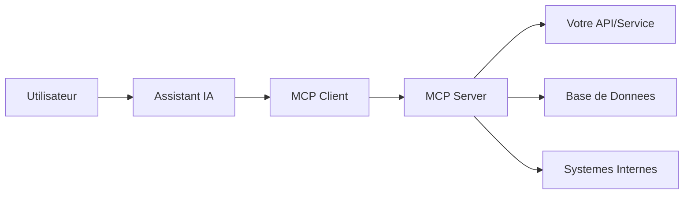

Un nouveau metier emerge sous nos yeux : **l'integrateur web IA**. Ces developpeurs ne se contentent plus de creer des sites pour les humains, ils les rendent **utilisables par les intelligences artificielles**.

<Note type="warning" title="Revolution en Cours">
D'ici 2027, **80% des interactions web** passeront par des assistants IA plutot que des navigateurs classiques. Les entreprises qui ne s'adaptent pas seront invisibles.
</Note>

---

## Le Changement de Paradigme

### De l'Interface Humaine a l'Interface Machine

Pendant 30 ans, le web a ete concu pour des **humains avec des yeux et des souris**. Ce modele est en train de mourir.

<Step>
  <StepItem title="Web 1.0 (1990-2005)">
    Sites statiques consultes par des humains via des navigateurs. HTML simple, peu d'interactivite.
  </StepItem>
  <StepItem title="Web 2.0 (2005-2020)">
    Sites dynamiques et interactifs. JavaScript, APIs REST, applications web. Toujours pour les humains.
  </StepItem>
  <StepItem title="Web 3.0 - Web IA (2024+)">
    Sites consultables ET utilisables par les IA. Les assistants deviennent les principaux utilisateurs. Besoin de standards d'integration.
  </StepItem>
</Step>

### Le Nouveau Parcours Client

**Avant (2023) :**
```
Utilisateur → Google → Clic sur site → Navigation → Action
```

**Maintenant (2025) :**
```
Utilisateur → ChatGPT → L'IA accede au site → L'IA effectue l'action → Resultat
```

L'utilisateur ne visite jamais votre site. **L'IA le fait pour lui.**

---

## Qu'est-ce qu'un Integrateur Web IA ?

### Definition

Un **integrateur web IA** est un developpeur specialise dans la creation d'interfaces permettant aux intelligences artificielles d'interagir avec des sites web et des services en ligne.

### Competences Cles

<CardGrid>
  <Card
    title="Developpement Backend"
    description="APIs REST/GraphQL, authentification, gestion des permissions, rate limiting."
  />
  <Card
    title="Protocoles IA"
    description="MCP (Model Context Protocol), OpenAPI, JSON Schema, standards d'interoperabilite."
  />
  <Card
    title="Architecture Systeme"
    description="Microservices, webhooks, queues, caching, scalabilite."
  />
  <Card
    title="Securite"
    description="OAuth, tokens, encryption, protection contre les abus, audit logs."
  />
  <Card
    title="Documentation"
    description="Specs techniques claires pour que les IA comprennent comment utiliser vos services."
  />
  <Card
    title="Testing & Monitoring"
    description="Tests automatises, observabilite, gestion des erreurs, debugging d'interactions IA."
  />
</CardGrid>

### Pourquoi Comprendre le Code est Essentiel

Contrairement au no-code marketing, l'integration web IA **exige une vraie expertise technique** :

**1. Complexite Architecturale**
- Les IA ont besoin de schemas precis, de structures de donnees rigoureuses
- Une API mal concue = une IA qui ne comprend pas comment l'utiliser
- Le code doit etre **predictible, documente, robuste**

**2. Securite Critique**
- Les IA peuvent executer des actions a grande echelle
- Une faille = milliers de requetes malveillantes en quelques secondes
- Besoin de rate limiting, validation stricte, permissions granulaires

**3. Performance et Scalabilite**
- Les IA peuvent generer des pics de trafic massifs
- Votre infra doit tenir la charge (caching, CDN, optimisation DB)
- Monitoring temps reel indispensable

**4. Standards en Evolution**
- Les protocoles d'integration IA evoluent rapidement
- Besoin de veille technique continue et d'adaptation
- Comprendre les specs en profondeur pour anticiper les changements

<Note type="info" title="Code > No-Code">
Le no-code a sa place pour des prototypes ou des workflows simples. Mais pour une **integration IA production-ready**, le code est **indispensable**.
</Note>

---

## Les Nouveaux Metiers qui Emergent

L'integration web IA n'est que le debut. Toute une economie de metiers techniques se construit autour de l'IA.

### 1. Integrateur Web IA

**Role** : Rendre les sites et services utilisables par les IA

**Missions :**
- Developper des MCP Servers
- Creer des APIs structurees pour IA
- Documenter les endpoints pour les modeles
- Gerer l'authentification et les permissions
- Monitorer les usages et optimiser les performances

**Profil** : Developpeur fullstack avec expertise APIs et securite

**Salaire estime** : 50-90k€/an (junior a senior)

### 2. Architecte de Systemes IA-Ready

**Role** : Concevoir des architectures d'entreprise compatibles IA

**Missions :**
- Auditer l'existant et identifier les points d'integration
- Designer des architectures modulaires et interoperables
- Definir les standards d'API internes pour l'IA
- Orchestrer les microservices et les flux de donnees
- Former les equipes techniques

**Profil** : Architecte systeme senior avec vision IA

**Salaire estime** : 70-120k€/an

### 3. Specialiste MCP & Protocoles IA

**Role** : Expert des standards d'integration IA (MCP, OpenAPI, etc.)

**Missions :**
- Implementer des serveurs MCP complexes
- Contribuer aux specs des protocoles open-source
- Creer des SDKs et librairies de connexion
- Former les developpeurs aux nouveaux standards
- Auditer la conformite des implementations

**Profil** : Developpeur senior avec expertise protocoles

**Salaire estime** : 60-100k€/an

### 4. Ingenieur Data pour IA

**Role** : Structurer les donnees pour qu'elles soient exploitables par les IA

**Missions :**
- Modeliser les bases de donnees pour l'interoperabilite IA
- Creer des pipelines d'export temps reel (JSON, GraphQL)
- Implementer des systemes de recherche semantique
- Optimiser les performances d'acces aux donnees
- Garantir la qualite et la coherence des donnees exposees

**Profil** : Data Engineer avec comprehension des besoins IA

**Salaire estime** : 55-95k€/an

### 5. DevOps IA-Oriented

**Role** : Gerer l'infrastructure et le deploiement de services IA-ready

**Missions :**
- Deployer et scaler des MCP Servers
- Monitorer les usages par les IA (rate limiting, quotas)
- Gerer les caches et CDN pour optimiser les reponses
- Automatiser les tests d'integration avec les assistants IA
- Securiser les endpoints et gerer les certificats

**Profil** : DevOps/SRE avec sensibilite IA

**Salaire estime** : 55-100k€/an

### 6. Product Manager Web IA

**Role** : Definir la strategie produit pour l'integration IA

**Missions :**
- Identifier les cas d'usage IA a prioriser
- Definir les fonctionnalites exposees aux assistants
- Arbitrer entre complexite technique et valeur business
- Mesurer l'adoption et l'impact des integrations IA
- Roadmap produit orientee IA

**Profil** : PM technique avec comprehension du potentiel IA

**Salaire estime** : 50-90k€/an

---

## Le Standard MCP : La Pierre Angulaire

Le **Model Context Protocol (MCP)** developpe par Anthropic est en passe de devenir le standard d'integration IA.

### Qu'est-ce que MCP ?

MCP est un protocole qui permet aux assistants IA (Claude, ChatGPT, etc.) de se connecter a des services externes de maniere **standardisee et securisee**.

**Analogie simple :**
- HTTP/REST = standard pour que les humains (via navigateurs) accedent aux services web
- **MCP = standard pour que les IA accedent aux services web**

### Architecture MCP



### Exemples Concrets d'Usage

**E-commerce :**
```
Utilisateur : "Trouve-moi des chaussures de running sous 100€"
→ L'IA se connecte via MCP a votre catalogue
→ Recherche en temps reel dans votre stock
→ Retourne les resultats avec prix et disponibilite
→ L'utilisateur peut commander directement via l'IA
```

**SaaS B2B :**
```
Utilisateur : "Genere un rapport des ventes du mois dernier"
→ L'IA s'authentifie via MCP sur votre plateforme
→ Recupere les donnees de ventes
→ Genere le rapport et l'envoie par email
→ Tout ca sans ouvrir votre interface web
```

**Service de Reservation :**
```
Utilisateur : "Reserve une table pour 4 ce soir a 20h"
→ L'IA consulte via MCP vos disponibilites
→ Cree la reservation
→ Envoie la confirmation
→ Le restaurant n'a jamais eu de visite humaine sur son site
```

---

## Impact sur les Habitudes de Consommation

L'integration web IA va **radicalement transformer** la facon dont nous consommons des services en ligne.

### La Fin du Clic

**Avant :**
1. Chercher sur Google
2. Comparer 5-10 sites
3. Cliquer, naviguer, lire
4. Prendre une decision
5. Passer a l'action

**Apres :**
1. Demander a l'IA
2. Recevoir une reponse directe
3. Valider l'action

**Le parcours passe de 10-15 minutes a 30 secondes.**

### La Fin de la Comparaison Manuelle

Les utilisateurs ne compareront plus. **L'IA le fera pour eux.**

Les criteres de choix changent :
- ❌ "Qui a le site le plus joli ?"
- ❌ "Qui apparait en premier sur Google ?"
- ✅ **"Qui est compatible IA ?"**
- ✅ **"Qui offre la meilleure integration ?"**
- ✅ **"Qui est cite par mon assistant prefere ?"**

### L'Emergence de l'Achat Delegue

Les utilisateurs vont **deleguer des achats recurrents** a leur IA :

```
"Chaque semaine, commande les courses habituelles au meilleur prix"
"Reserve automatiquement mes restaurants preferes quand je suis en ville"
"Achete les fournitures de bureau quand les stocks sont bas"
```

Les entreprises qui ne sont pas **integrees IA** seront exclues de ces achats automatiques.

### La Mort des Marketplaces ?

Les marketplaces (Amazon, Booking, Uber Eats) perdent de leur pertinence :
- Leur valeur = agréger l'offre et simplifier la comparaison
- **Les IA font ca mieux**, sans interface, sans commission
- Les fournisseurs pourront vendre **directement** via leurs MCP servers

**Exemple :**
```
Utilisateur : "Commande-moi une pizza margherita"
→ L'IA interroge directement les pizzerias du quartier (via MCP)
→ Compare prix, delais, avis
→ Passe commande chez le meilleur
→ Uber Eats n'est jamais dans la boucle
```

### La Nouvelle Economie de l'Attention

**Avant :** Les entreprises se battaient pour l'**attention** des utilisateurs (SEO, pub, UX)

**Maintenant :** Les entreprises se battent pour la **confiance des IA**
- Etre recommande par Claude, ChatGPT, Perplexity
- Avoir une integration technique impeccable
- Offrir des APIs rapides, fiables, bien documentees

**Les gagnants :** Ceux qui investissent **maintenant** dans l'integration IA

---

## Nos Services d'Integration Web IA

Nous vous accompagnons pour rendre votre business **IA-Ready**.

### 1. Audit d'Integrabilite

**Objectif :** Evaluer votre capacite a etre utilise par les IA

**Analyse :**
- Architecture technique existante
- APIs disponibles et leur qualite
- Donnees exposables et leur structure
- Lacunes de securite ou de performance
- Cas d'usage prioritaires

**Livrable :** Rapport complet + roadmap d'integration

**Tarif :** 3 000€ (one-time)

### 2. Developpement de MCP Server

**Objectif :** Creer un serveur MCP pour exposer vos services aux IA

**Inclus :**
- Analyse des besoins et design de l'architecture
- Developpement du MCP Server (Node.js/Python)
- Implementation des endpoints principaux
- Gestion d'authentification et permissions
- Documentation technique complete
- Tests et debugging
- Deploiement en production

**Duree :** 4-8 semaines selon complexite

**Tarif :** A partir de 12 000€

### 3. Architecture API Compatible IA

**Objectif :** Refondre ou optimiser vos APIs pour les rendre exploitables par les IA

**Inclus :**
- Audit de vos APIs existantes
- Design d'une architecture RESTful/GraphQL optimisee
- Specifications OpenAPI 3.0+
- Implementation des endpoints prioritaires
- Rate limiting et securite
- Documentation auto-generee
- SDK/Client examples

**Duree :** 6-12 semaines

**Tarif :** A partir de 18 000€

### 4. Formation Equipe Technique

**Objectif :** Former vos developpeurs aux standards d'integration IA

**Programme :**
- Introduction aux protocoles IA (MCP, OpenAPI)
- Bonnes pratiques d'architecture API
- Securite et gestion des permissions
- Documentation technique pour IA
- Hands-on : developper un MCP server simple
- Q&A et cas d'usage specifiques

**Format :** 2 jours en presentiel ou 4 sessions de 3h en remote

**Tarif :** 5 000€ (jusqu'a 10 personnes)

### 5. Integration avec Assistants IA

**Objectif :** Connecter votre service aux principaux assistants (ChatGPT, Claude, etc.)

**Inclus :**
- Configuration des integrations natives (ChatGPT Plugins, Claude MCP)
- Tests et validation des flux
- Monitoring et analytics d'usage
- Optimisation des prompts systeme
- Support post-lancement (1 mois)

**Duree :** 3-6 semaines

**Tarif :** A partir de 8 000€

### 6. Accompagnement Long Terme

**Objectif :** Support continu pour evoluer avec les standards IA

**Inclus :**
- Maintenance et evolution de vos MCP servers
- Veille technologique sur les nouveaux protocoles
- Optimisations regulieres
- Support technique prioritaire
- Rapports mensuels d'usage et recommandations

**Tarif :** A partir de 3 500€/mois

---

## Technologies et Stack

Nous utilisons les technologies les plus modernes pour garantir performance et compatibilite.

<CardGrid>
  <Card
    title="Backend"
    description="Node.js, Python (FastAPI), Go selon les besoins. APIs REST et GraphQL."
  />
  <Card
    title="MCP Framework"
    description="SDK Anthropic officiel, implementation custom selon besoin, support TypeScript et Python."
  />
  <Card
    title="Base de Donnees"
    description="PostgreSQL, MongoDB, Redis pour le caching. Optimisation pour requetes rapides."
  />
  <Card
    title="Infrastructure"
    description="Docker, Kubernetes, AWS/GCP/Azure. Scalabilite automatique et haute disponibilite."
  />
  <Card
    title="Securite"
    description="OAuth 2.0, JWT, rate limiting, encryption, audit logs. Conformite RGPD."
  />
  <Card
    title="Monitoring"
    description="Prometheus, Grafana, Sentry. Observabilite temps reel et alerting."
  />
</CardGrid>

---

## Cas d'Usage par Secteur

### E-commerce

**Probleme :** Les utilisateurs demandent a ChatGPT "ou acheter X" et votre site n'est pas dans les suggestions

**Solution :** MCP Server exposant votre catalogue en temps reel
- Recherche produits
- Consultation stock et prix
- Ajout au panier
- Passage de commande

**Impact :** Nouveau canal de vente sans commission marketplace

### SaaS B2B

**Probleme :** Vos clients doivent se connecter a votre interface pour extraire des donnees

**Solution :** API compatible IA pour que leurs assistants recuperent les donnees directement
- Export de rapports
- Consultation de metriques
- Creation de ressources
- Automatisation de workflows

**Impact :** Meilleure retention, differentiation concurrentielle

### Services Locaux (Restaurants, Salons, etc.)

**Probleme :** Invisibles dans les recherches conversationnelles des assistants IA

**Solution :** MCP Server simple exposant disponibilites et reservations
- Consultation des horaires
- Verification des places disponibles
- Prise de reservation
- Envoi de confirmations

**Impact :** Nouveau flux de clients sans passer par des plateformes a commission

### Media & Contenu

**Probleme :** Les IA citent vos concurrents mais pas vous

**Solution :** APIs structurees pour faciliter l'acces au contenu
- Recherche semantique dans vos articles
- Export de contenus avec metadata
- Systeme de citations automatiques
- Tracking des utilisations

**Impact :** Plus de visibilite, plus de trafic qualifie

---

## FAQ

### C'est quoi la difference entre une API classique et un MCP Server ?

Une **API classique** est concue pour des developpeurs humains. Un **MCP Server** est concu pour des IA :
- Schema strictement type (JSON Schema)
- Documentation auto-descriptive
- Gestion d'erreurs predictible
- Rate limiting adapte aux IA
- Securite renforcee

### Est-ce que MCP va devenir le standard ?

MCP a de fortes chances de s'imposer car :
- Soutenu par Anthropic (Claude)
- Open source et bien documente
- Deja adopte par des gros acteurs
- Simple a implementer

Mais d'autres standards pourraient emerger. Nous suivons tous les protocoles et adaptons nos implementations.

### Combien de temps pour implementer un MCP Server ?

Depend de la complexite :
- **MCP simple** (lecture seule, quelques endpoints) : 2-4 semaines
- **MCP complet** (CRUD, authentification, permissions) : 6-10 semaines
- **MCP enterprise** (multi-tenant, haute dispo, monitoring) : 3-6 mois

### C'est securise ?

Oui, si c'est bien fait. Nous implementons :
- Authentification OAuth 2.0
- Rate limiting strict
- Validation des entrees
- Permissions granulaires
- Audit logs de toutes les actions
- Encryption des donnees sensibles

### Quel ROI attendre ?

Difficile a chiffrer precisement (marche nouveau), mais nos clients observent :
- Nouveau canal d'acquisition (5-15% du trafic en 6 mois)
- Reduction des couts d'acquisition (pas de commission)
- Differentiation concurrentielle forte
- Meilleure retention (experience fluide)

**ROI estime** : 3-5x l'investissement initial sur 12-18 mois

---

## L'Opportunite Historique

Nous sommes en **2025**. C'est l'equivalent de **1998 pour le web classique**.

Les entreprises qui ont investi dans le web en 1998-2000 ont domine leur secteur pendant 20 ans.

**Celles qui investissent dans l'integration IA maintenant auront le meme avantage.**

<Note type="success" title="First Mover Advantage">
Dans 3 ans, tout le monde aura des MCP servers. Aujourd'hui, presque personne. **C'est le moment d'agir.**
</Note>

### Pourquoi Maintenant ?

**1. Marche vierge**
- Tres peu de concurrence
- Les utilisateurs decouvrent l'usage
- Positionnement facile comme pionnier

**2. Standards en formation**
- Vous pouvez influencer les bonnes pratiques
- Les protocoles sont encore souples
- Moins de contraintes techniques

**3. Attention des medias**
- Etre early adopter = visibilite gratuite
- Articles, interviews, conferences
- Positionnement d'expert

**4. Couts d'acquisition faibles**
- Pas encore de pub sur ces canaux
- Trafic organique sans concurrence
- Relations directes avec les assistants IA

---

## Demarrer Votre Integration

<Step>
  <StepItem title="1. Audit Gratuit (30 min)">
    Nous analysons votre situation et evaluons le potentiel d'integration IA pour votre business.
  </StepItem>
  <StepItem title="2. POC Rapide (2-4 semaines)">
    Nous developpons un MCP Server minimal sur un cas d'usage simple pour demontrer la faisabilite.
  </StepItem>
  <StepItem title="3. Integration Complete (2-6 mois)">
    Deploiement d'une solution production-ready avec tous les use cases prioritaires.
  </StepItem>
  <StepItem title="4. Evolution Continue">
    Support, maintenance, et adaptation aux nouveaux standards et assistants IA.
  </StepItem>
</Step>

---

<Note type="success" title="Contactez-nous">
Pret a rendre votre business utilisable par les IA ? Parlons-en : [contact@authenlink.com](mailto:contact@authenlink.com)
</Note>
